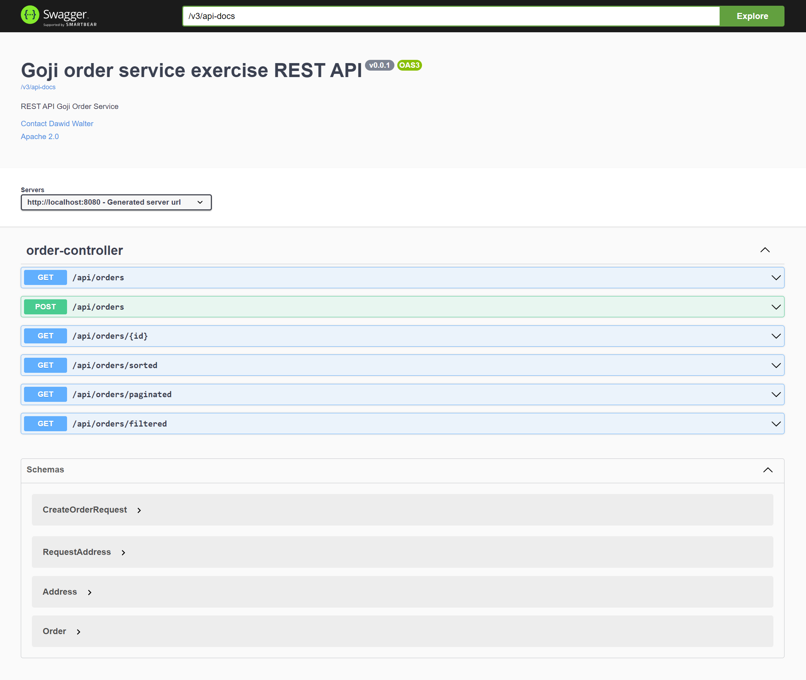

***
Author: Dawid Walter | Email: [davedohc@aim.com](davedohc@aim.com)
***

## Application for Goji interview process

REST API service which provide CRUD operations for Order business domain

Tech stack:
1. Java 17
2. Spring Boot Framework 3.0
3. H2 in-memory database (sql relational)
4. Spring JPA to access data source
5. JUnit 5, Mockito, MockMVC, AssertJ for tests
6. SpringDoc OpenApi for generating swagger-ui API documentation
7. Lombok for autogenerate boilerplate code

to build application:
```
mvn install
```
to run application:
```
mvn compile exec:java
```
***

Spring Boot application will start, creating local server on port 8080.

All API endpoints are documented using swagger and can be accessed and tried on this URL: [http://localhost:8080/swagger-ui.html](http://localhost:8080/swagger-ui.html)


***



***

# code challenge
Here we have a Maven Spring Boot application. This application will manage `Order` resource. Please implement the following 3 endpoints based on given requirements.

## prerequisites

- Java 17
- Maven

## requirements

- Create an `Order` 

**Request**: `POST /api/orders`

```json
{
  "productId": "a3e51622-2693-4930-aeb9-70d89f504eef",
  "invoiceId": "5e5a327c-957d-11ed-a1eb-0242ac120002",
  "currency": "GBP",
  "comment": "gift",
  "shipping": {
    "street": "2 Bond Street",
    "postCode": "SW00 0SW",
    "city": "London",
    "country": "UK"
  }
}
```

**Response**:
```json
{
  "orderId": "534ea7e0-957e-11ed-a1eb-0242ac120002"
}
```

- Get an `Order` by `id`
  
**Request**: `GET /api/orders/534ea7e0-957e-11ed-a1eb-0242ac120002`

**Response**:

```json
{
  "id": "534ea7e0-957e-11ed-a1eb-0242ac120002",
  "productId": "a3e51622-2693-4930-aeb9-70d89f504eef",
  "invoiceId": "5e5a327c-957d-11ed-a1eb-0242ac120002",
  "currency": "GBP",
  "comment": "gift",
  "shipping": {
    "street": "2 Bond Street",
    "postCode": "SW00 0SW",
    "city": "London",
    "country": "UK"
  }
}
```

- Please design and implement an endpoint that lists `Order`s (bonus point for filters). 


## submission

- We expect you to spend about 1-2 hours on this.
- You are free to add/remove dependencies and modify packages.
- Any storage solution is acceptable.
- Please add tests and documentation as you feel appropriate. 
- Please create a PR, at least 24 before your in-person interview.
- Any questions, please email: [Jonathan Evans](mailto:jonathan.evans@goji.investments)
